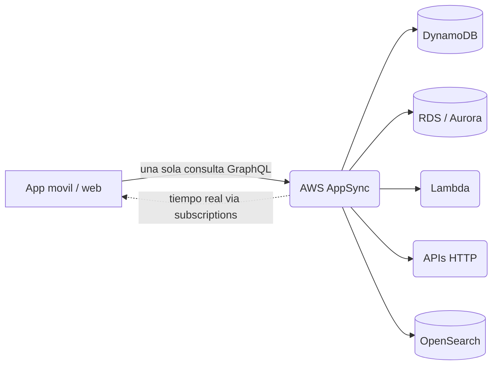
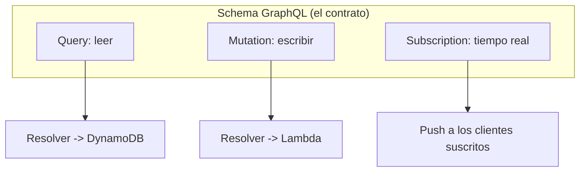
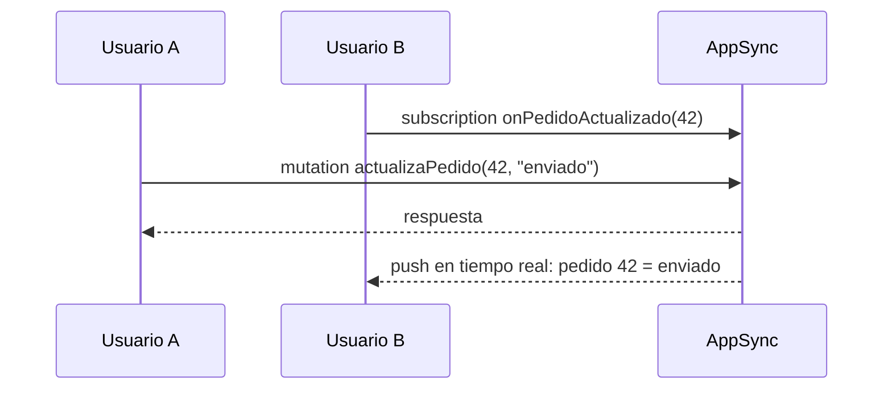
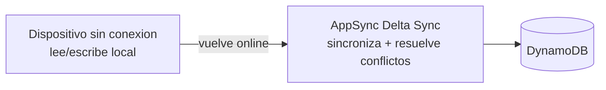
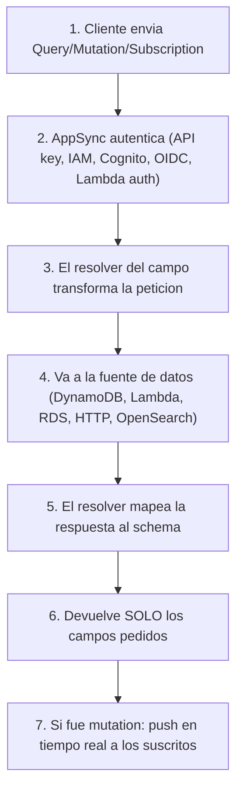
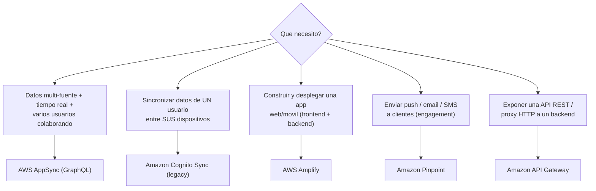
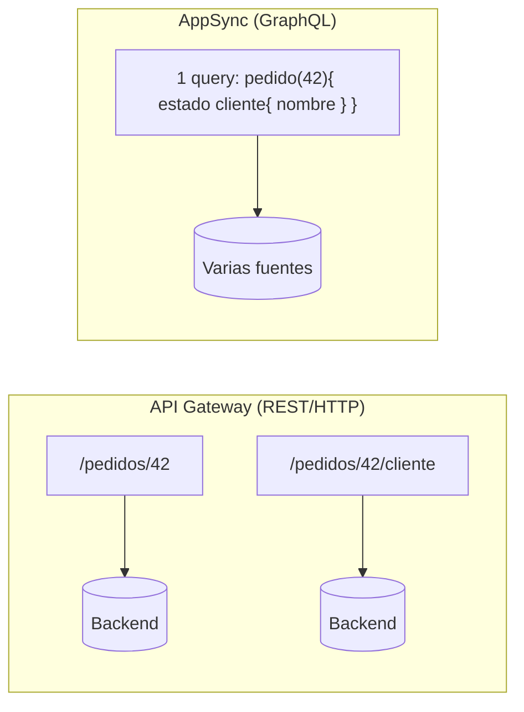

# AWS AppSync a fondo: GraphQL gestionado, tiempo real y offline

Guia visual para entender **que es AppSync**, **como funciona** y **en que se diferencia** de los servicios con los que se suele confundir (Cognito Sync, Amplify, Pinpoint, API Gateway).

---

## 1. La idea en una frase

> **AWS AppSync es un servicio gestionado que te da una API GraphQL para leer, escribir y combinar datos de varias fuentes, con actualizaciones en tiempo real y acceso offline.**

Su superpoder frente a otros servicios de sincronizacion: permite que **varios usuarios colaboren sobre datos compartidos en tiempo real**, no solo sincronizar los datos de un unico usuario entre sus dispositivos.

Con REST tradicional pedirias a varios endpoints y unirias los datos en el cliente. Con **GraphQL** en AppSync, el cliente pide **exactamente** los campos que necesita en **una sola** peticion, y AppSync los resuelve desde una o varias fuentes.

---

## 2. Que es GraphQL (el corazon de AppSync)

**GraphQL** es un lenguaje de consulta para APIs. En vez de muchos endpoints REST, tienes **un solo endpoint** y un **schema** que declara los tipos y las operaciones.

Tres tipos de operacion:

| Operacion | Que hace | Analogia |
|---|---|---|
| **Query** | Leer datos | "dame el pedido 42 con su cliente" |
| **Mutation** | Crear / actualizar / borrar | "cambia el estado del pedido a enviado" |
| **Subscription** | Recibir cambios en **tiempo real** | "avisame cuando cambie el pedido 42" |

Cada campo del schema se conecta a una fuente de datos mediante un **resolver** (la pieza que traduce la peticion GraphQL a la llamada real a DynamoDB, Lambda, etc.).

> **Idea clave del "pide solo lo que necesitas":** el cliente controla la forma de la respuesta. Pide 2 campos y recibe 2 campos; pide un objeto anidado y AppSync lo arma. Esto reduce sobre-fetching y viajes de red.

---

## 3. Las tres capacidades que hay que recordar

### 3.1 Tiempo real (subscriptions)

Cuando un cliente hace una **mutation**, AppSync empuja el cambio a **todos** los clientes suscritos a esa subscription, por WebSockets. Asi varios usuarios ven el mismo dato actualizarse al instante.

### 3.2 Offline y sincronizacion (Delta Sync)

Las apps moviles/web pueden **leer datos locales sin conexion** y, al volver online, **sincronizar** los cambios con **resolucion de conflictos** configurable. En movil esto se suele consumir via **Amplify DataStore**, que usa AppSync por debajo.

### 3.3 Multi-usuario colaborativo (el diferenciador)

Combina las dos anteriores: varios usuarios editan un mismo documento/estado y todos convergen al mismo dato en tiempo real. Este es el punto que distingue a AppSync de Cognito Sync.

---

## 4. Como fluye una peticion en AppSync

**Autenticacion**: AppSync admite API key, IAM, **Cognito User Pools**, OIDC y **Lambda authorizers**. (Nota util: Cognito y AppSync se usan juntos con frecuencia; Cognito autentica, AppSync sirve los datos.)

---

## 5. Comparacion con servicios parecidos (lo que mas se confunde)

| Servicio | Para que sirve | Tiempo real | Multi-usuario colaborativo | Se confunde con AppSync porque... |
|---|---|---|---|---|
| **AWS AppSync** | API **GraphQL** gestionada sobre varias fuentes | Si (subscriptions) | **Si** | (es la respuesta correcta) |
| **Amazon Cognito Sync** | Sincroniza datasets de **un usuario** entre sus dispositivos | Push de "hay cambios" | **No** | tambien "sincroniza datos entre dispositivos". *Legacy: AWS recomienda AppSync.* |
| **AWS Amplify** | Framework para **construir y desplegar** apps web/movil | Via AppSync por debajo | Via AppSync | tambien aparece en apps moviles; pero Amplify es el **framework**, no el servicio de datos |
| **Amazon Pinpoint** | **Engagement**: push, email, SMS, voz, campanas | No aplica | No | dicen "notificar a usuarios", pero es mensajeria, no datos |
| **Amazon API Gateway** | Exponer APIs **REST/HTTP/WebSocket** a un backend | WebSocket manual | No nativo | ambos son "capas de API"; API GW es REST/HTTP, AppSync es GraphQL gestionado |

---

## 6. AppSync vs API Gateway (la comparacion tecnica mas util)

Ambos ponen una "capa de API" delante de tu backend, pero resuelven cosas distintas:

| Criterio | API Gateway | AppSync |
|---|---|---|
| Estilo de API | REST / HTTP / WebSocket | **GraphQL** |
| Numero de endpoints | Muchos (uno por recurso) | **Uno** |
| Forma de la respuesta | La define el backend | **La define el cliente** (pide campos) |
| Tiempo real | WebSocket (manual) | **Subscriptions integradas** |
| Sobre/infra-fetching | Comun | Se minimiza (pides lo justo) |
| Caso tipico | API REST clasica, proxy Lambda | Apps con datos combinados y tiempo real |

> **Regla de examen:** si el escenario dice **"GraphQL"**, **"tiempo real"** y **"varios usuarios colaboran sobre datos compartidos"** -> **AppSync**. Si dice **"solo un usuario sincroniza entre sus dispositivos"** -> Cognito Sync. Si dice **"REST"** o **"proxy HTTP"** -> API Gateway.

---

## 7. Cuando elegir AppSync

Buen encaje:

- Apps moviles/web que **combinan datos de varias fuentes** en una sola vista.
- Necesitas **actualizaciones en tiempo real** (chat, tableros, juegos, colaboracion).
- Necesitas **offline + sincronizacion** con resolucion de conflictos.
- Quieres que el **cliente controle** que campos recibe (menos viajes de red).

No es el encaje ideal si:

- Solo necesitas una **API REST simple** -> API Gateway.
- Solo necesitas **sincronizar un usuario** entre dispositivos -> (historicamente Cognito Sync; hoy AppSync/DataStore).
- Lo tuyo es **mensajeria/campanas** -> Pinpoint.

---

## 8. Resumen en 30 segundos

1. **AppSync = GraphQL gestionado** sobre varias fuentes (DynamoDB, Lambda, RDS, HTTP, OpenSearch).
2. Tres operaciones: **Query** (leer), **Mutation** (escribir), **Subscription** (tiempo real).
3. Da **tiempo real**, **offline + sync con resolucion de conflictos**, y **colaboracion multi-usuario** (su diferenciador).
4. **Cognito Sync** = un usuario entre sus dispositivos (legacy). **Amplify** = framework para construir apps. **Pinpoint** = mensajeria. **API Gateway** = REST/HTTP.
5. En el examen: "GraphQL + tiempo real + varios usuarios colaborando" -> **AppSync**.

**Enlaces oficiales:**

- Que es AppSync: https://docs.aws.amazon.com/appsync/latest/devguide/what-is-appsync.html
- Datos en tiempo real (subscriptions): https://docs.aws.amazon.com/appsync/latest/devguide/aws-appsync-real-time-data.html
- Offline / Delta Sync: https://docs.aws.amazon.com/appsync/latest/devguide/tutorial-delta-sync.html
- Cognito Sync (contexto, legacy): https://docs.aws.amazon.com/cognito/latest/developerguide/cognito-sync.html
