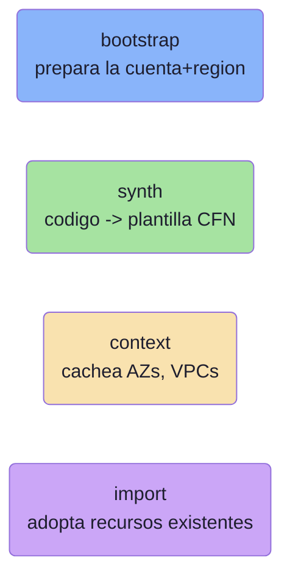
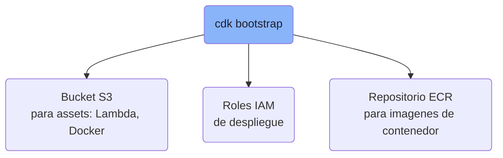
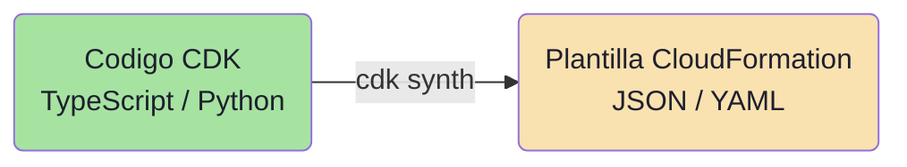
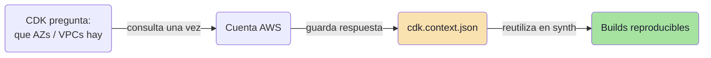
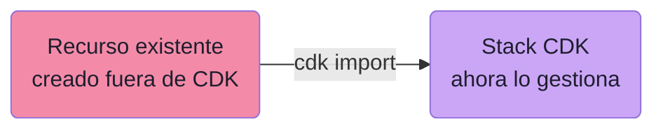
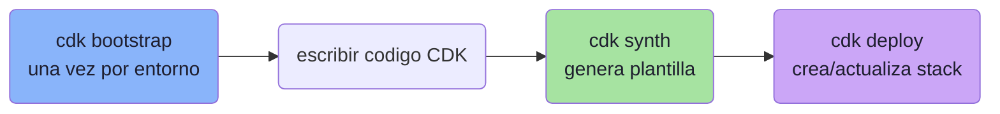

# AWS CDK: bootstrap, synth, context e import

## La pregunta

¿Qué hace cada comando del CDK CLI? Cada uno tiene una función distinta y es fácil confundirlos.

**Respuesta correcta (B):**

- **bootstrap**: provisiona los recursos base del entorno.
- **synth**: genera la plantilla CloudFormation.
- **context**: cachea datos del entorno (AZs, VPCs).
- **import**: trae recursos existentes al stack.

---

## Los 4 comandos de un vistazo

---

## `cdk bootstrap` — preparar el entorno

Se corre **una sola vez por cuenta + región**. Crea la infraestructura que CDK necesita para desplegar:

Sin bootstrap, un `deploy` que use assets falla porque no hay dónde subirlos.

---

## `cdk synth` — compilar a CloudFormation

Traduce tu código CDK (TypeScript, Python, Java...) a una **plantilla CloudFormation**:

Es como un "compilador": de código de alto nivel a la plantilla que CloudFormation sabe ejecutar. No despliega nada, solo genera el template.

---

## `cdk context` — cachear datos del entorno

Cuando CDK necesita datos reales de tu cuenta (qué AZs hay, qué VPCs existen), los consulta y los **guarda en `cdk.context.json`** para reutilizarlos:

Beneficio: las builds son **reproducibles**. El resultado no cambia entre corridas aunque el entorno cambie. `cdk context` te deja ver y limpiar ese caché.

---

## `cdk import` — adoptar recursos existentes

Incorpora a un stack recursos que **ya existen** (creados a mano o por otra herramienta), usando los *resource imports* de CloudFormation:

CDK empieza a gestionar el recurso **sin recrearlo ni borrarlo**. Útil para migrar infra existente a CDK.

---

## Tabla comparativa

| Comando | Qué hace | Cuándo se usa |
|---|---|---|
| **bootstrap** | Provisiona bucket S3, roles IAM y ECR en la cuenta+región | Una vez por entorno |
| **synth** | Compila el código CDK a plantilla CloudFormation | Cada vez que cambias el código |
| **context** | Cachea AZs, VPCs y otros datos del entorno | Automático al sintetizar; lo gestionas para reproducibilidad |
| **import** | Adopta recursos ya existentes en un stack | Al migrar infra existente a CDK |

---

## Por qué fallan las otras opciones

Todas **intercambian las definiciones**:

| Opción | Error |
|---|---|
| A | Dice que bootstrap importa recursos y synth cachea; falso |
| C | Dice que synth importa y context genera el template; falso |
| D | Dice que synth provisiona el entorno e import cachea datos; falso |

Solo **B** asigna las cuatro funciones correctamente.

---

## El flujo típico de trabajo

---

## Resumen de examen (DVA-C02)

- **bootstrap** = prepara la cuenta+región (S3 assets, IAM, ECR). Una vez por entorno.
- **synth** = código → plantilla CloudFormation. No despliega.
- **context** = caché de datos del entorno (AZs, VPCs) en `cdk.context.json` → builds reproducibles.
- **import** = adopta recursos existentes en un stack sin recrearlos.
- Flujo: **bootstrap → escribir código → synth → deploy**.
