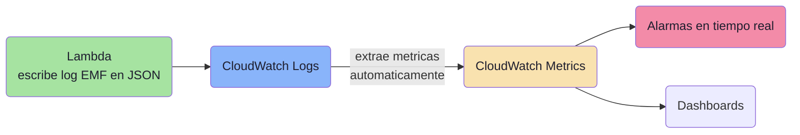
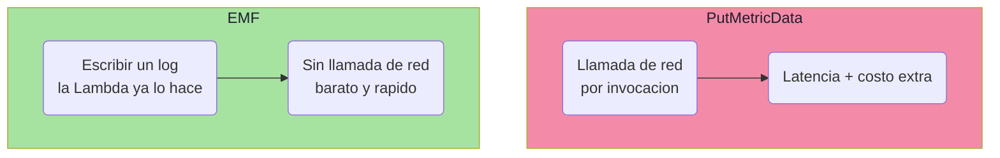
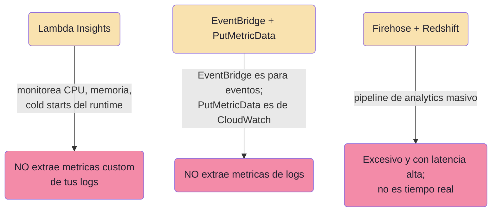

# CloudWatch Embedded Metric Format (EMF): métricas custom desde logs de Lambda

## El problema

Un equipo quiere:

- extraer **métricas custom** (ej. tiempos de procesamiento) directamente de los **logs** de una Lambda,
- analizarlas,
- poner **alarmas en tiempo real**.

¿Qué enfoque usar?

**Respuesta: CloudWatch Embedded Metric Format (EMF).**

---

## La idea clave

Normalmente, para publicar una métrica custom llamas a la API `PutMetricData`: una llamada de red extra por cada invocación. En una Lambda (que vive segundos), eso añade **latencia y costo**.

EMF lo resuelve: tu Lambda **escribe un log JSON estructurado especial** con las métricas embebidas. CloudWatch Logs **detecta ese formato y extrae las métricas automáticamente**. Sin llamadas de red extra.



---

## Por qué encaja perfecto con Lambda

Las Lambdas son recursos **efímeros**: viven segundos y desaparecen. No quieres depender de llamadas API síncronas justo cuando la función va a terminar.



AWS provee **librerías open-source** (Python, Node.js, Java) que arman el JSON EMF por ti: solo declaras la métrica y la librería genera el formato correcto.

---

## Cómo se ve un log EMF (simplificado)

```json
{
  "_aws": {
    "Timestamp": 1609459200000,
    "CloudWatchMetrics": [
      {
        "Namespace": "MiApp",
        "Dimensions": [["FunctionName"]],
        "Metrics": [{ "Name": "TiempoProcesamiento", "Unit": "Milliseconds" }]
      }
    ]
  },
  "FunctionName": "procesar-pedidos",
  "TiempoProcesamiento": 245,
  "mensaje": "Pedido procesado OK"
}
```

- El bloque `_aws` le dice a CloudWatch **qué extraer** como métrica.
- `TiempoProcesamiento: 245` es el valor de la métrica embebido.
- El resto (`mensaje`) sigue siendo un log normal, consultable en Logs Insights.

Un solo log = un log legible **y** una métrica para alarmar.

---

## Por qué fallan las otras opciones



| Opción | Por qué NO |
|---|---|
| **B — Lambda Insights** | Monitorea el rendimiento del runtime (CPU, memoria, duración), no tus métricas custom de negocio desde los logs |
| **C — EventBridge + PutMetricData** | EventBridge es para arquitecturas de eventos; `PutMetricData` es de CloudWatch (mezclan servicios); no extrae métricas de logs |
| **D — Firehose + Redshift** | Pipeline de analytics a gran escala; pesado y con latencia alta; incompatible con "tiempo real" |

---

## EMF vs PutMetricData (las dos formas de métricas custom)

| Aspecto | PutMetricData | **EMF** |
|---|---|---|
| Cómo publica | Llamada API directa | Escribe un log estructurado |
| Llamada de red extra | Sí | **No** |
| Ideal para | Código de larga vida | **Lambda / contenedores efímeros** |
| Log + métrica juntos | No | **Sí (un solo evento)** |

---

## Resumen de examen (DVA-C02)

Señales del enunciado que apuntan a EMF:

- **"métricas custom desde los logs"** → EMF extrae métricas de logs estructurados.
- **"recurso efímero" (Lambda / contenedor)** → EMF evita llamadas API síncronas.
- **"tiempo real" + "alarmas"** → CloudWatch nativo.

Regla corta:

> Métricas custom embebidas en logs de recursos efímeros + alarmas en tiempo real → **Embedded Metric Format (EMF)**.

Matiz clave: `PutMetricData` = API directa (código de larga vida). **EMF = log estructurado (Lambda/contenedores).** Si el enunciado enfatiza "desde los logs" o "efímero", es EMF.
