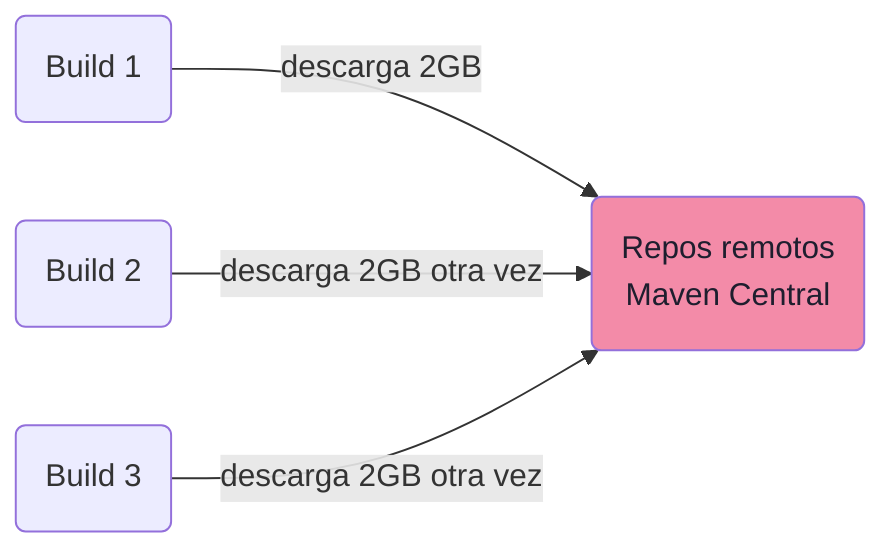
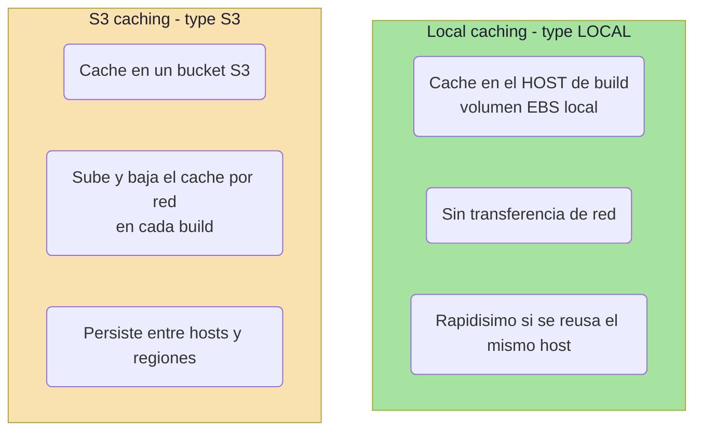
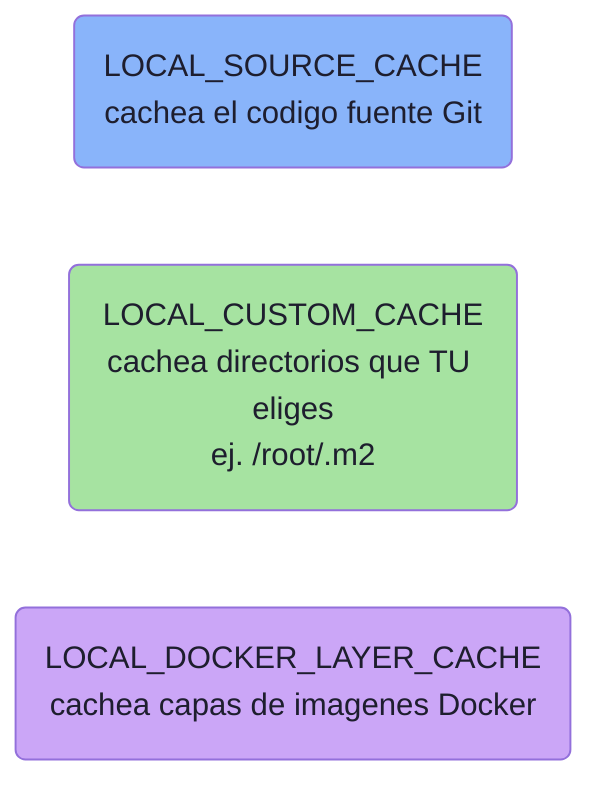
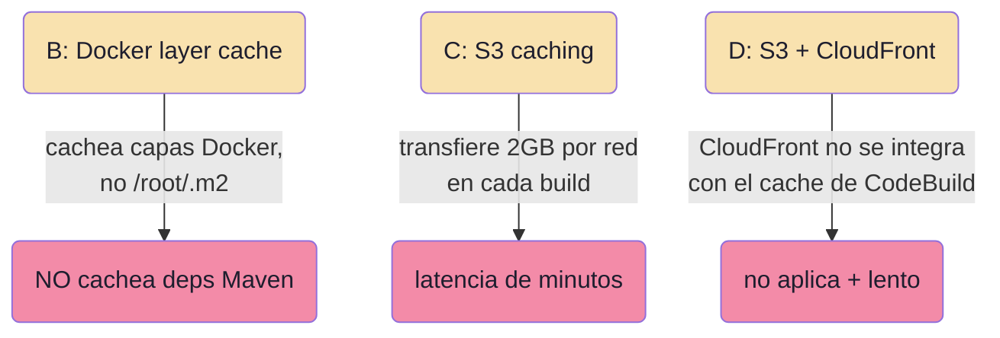

# CodeBuild caching: local vs S3 para dependencias Maven

## El escenario

- App Java compilada con **Maven** en **CodeBuild**.
- Cada build tarda **15 min** y descarga **2 GB de dependencias** desde repos remotos.
- Se ejecutan **builds múltiples veces al día** sobre el **mismo proyecto**.

¿Qué estrategia de caching optimiza mejor los tiempos?

**Respuesta correcta (A): Local caching** con `type: LOCAL` y modos `[LOCAL_SOURCE_CACHE, LOCAL_CUSTOM_CACHE]`, cacheando `/root/.m2/**/*`.

---

## El problema que resolvemos

Sin cache, cada build vuelve a descargar los mismos 2 GB de dependencias desde internet. Eso es tiempo y ancho de banda desperdiciados en cada ejecución.



El cache guarda esas dependencias (`/root/.m2`) para reutilizarlas entre builds.

---

## Las dos formas de cachear en CodeBuild



### La decisión clave

| Pregunta | Si SÍ |
|---|---|
| ¿Mismo proyecto, alta frecuencia, misma región? | **LOCAL** |
| ¿Builds ocasionales o cross-region? | **S3** |
| ¿Cache grande (GB) reusado seguido? | **LOCAL** (evita transferir GB por red) |

En este caso: **2 GB + builds múltiples diarios + mismo proyecto** → **LOCAL** gana claramente. Transferir 2 GB desde/hacia S3 en cada build añadiría minutos de latencia; el acceso local en el EBS del host es casi instantáneo.

---

## Los tres modos de LOCAL caching



Para dependencias Maven usas **`LOCAL_CUSTOM_CACHE`** con `paths` apuntando a `/root/.m2`. Se combina bien con `LOCAL_SOURCE_CACHE` para no re-clonar todo el repo Git cada vez.

---

## La configuración correcta (buildspec.yml)

```yaml
version: 0.2
phases:
  build:
    commands:
      - mvn package
cache:
  type: LOCAL
  modes:
    - LOCAL_SOURCE_CACHE
    - LOCAL_CUSTOM_CACHE
  paths:
    - '/root/.m2/**/*'
```

Detalles importantes:

- `paths` va **dentro de la sección `cache`**, NO en `artifacts` (artifacts es para los *outputs* del build, no para el cache).
- `/root/.m2/**/*` es donde Maven guarda las dependencias descargadas.

---

## Por qué fallan las otras opciones (etiquetas corregidas)

| Opción | Qué propone | Por qué NO |
|---|---|---|
| **B** | Docker layer caching (`LOCAL_DOCKER_LAYER_CACHE`) con `paths` en `artifacts` | Ese modo cachea **capas de imágenes Docker**, no directorios del filesystem como `/root/.m2`. Además `paths` debe ir en `cache`, no en `artifacts`. No cachearía las dependencias Maven |
| **C** | S3 caching (`type: S3`) para `/root/.m2` | Funciona, pero transferir 2 GB desde/hacia S3 **en cada build** añade minutos de latencia. S3 es mejor para builds ocasionales o cross-region, no para builds frecuentes del mismo proyecto |
| **D** | S3 + CloudFront delante del bucket | CloudFront **no se integra** con el mecanismo de cache de CodeBuild; CodeBuild accede directo al bucket S3. No hay forma de interponer CloudFront. Y seguiría siendo más lento que local |



---

## Comparación directa: LOCAL vs S3 para este caso

| Aspecto | **LOCAL (correcta)** | S3 |
|---|---|---|
| Dónde vive el cache | Host de build (EBS local) | Bucket S3 |
| Transferencia de red | Ninguna | Sube/baja el cache cada build |
| 2 GB reusados seguido | Casi instantáneo | Minutos de latencia |
| Persiste entre hosts/regiones | No garantizado | Sí |
| Mejor para | Builds frecuentes, mismo proyecto/región | Builds ocasionales o cross-region |

---

## Resumen de examen (DVA-C02)

Regla mnemotécnica:

- **Archivos grandes (GB) + builds frecuentes + mismo proyecto/región** → **LOCAL caching**.
- **Builds ocasionales o cross-region** → **S3 caching**.
- Dependencias en directorio (Maven `.m2`, npm `node_modules`, pip cache) → **`LOCAL_CUSTOM_CACHE` + `paths`**.
- `LOCAL_DOCKER_LAYER_CACHE` = solo capas Docker, no filesystem.
- `paths` siempre va en la sección **`cache`**, nunca en `artifacts`.
