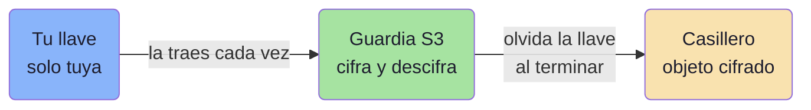
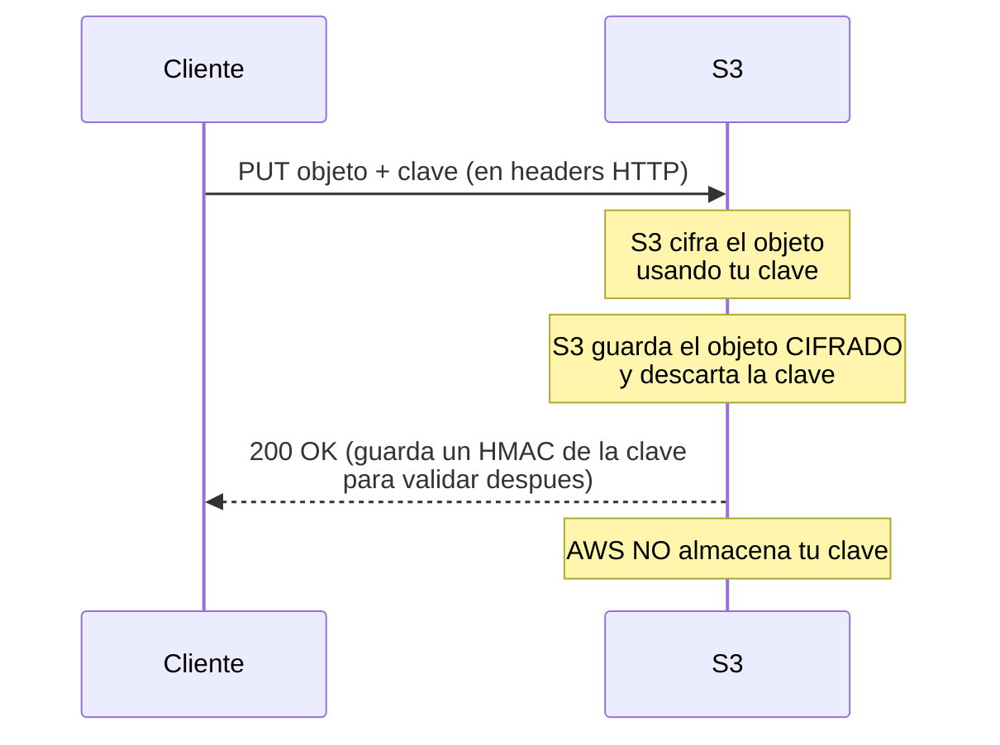
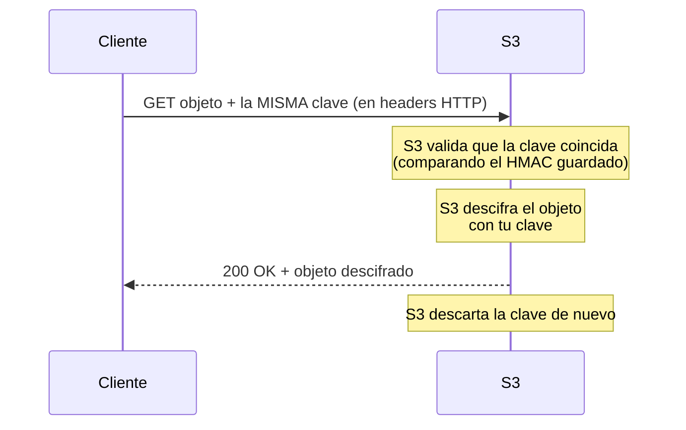
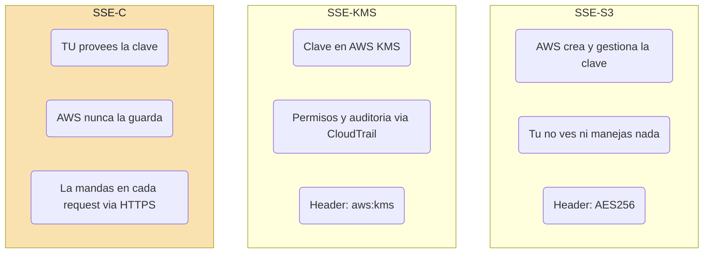

# SSE-C explicado: "el cliente la provee en cada request"

## La idea en una frase

**SSE-C** = *Server-Side Encryption with Customer-provided keys* (cifrado del lado del servidor con claves provistas por el cliente).

S3 cifra y descifra tus objetos por ti (por eso es *server-side*), pero **la clave de cifrado es tuya y AWS nunca la guarda**. Como AWS no la almacena, **tú tienes que enviar la clave en cada petición** (`PUT` para subir, `GET` para bajar). De ahí la frase: *"el cliente la provee en cada request"*.

---

## La analogía del casillero

Imagina un casillero con un guardia:

- El **guardia** (S3) es quien físicamente cierra y abre la puerta (cifra/descifra).
- La **llave** (tu clave) es solo tuya. El guardia nunca se queda con una copia.
- Cada vez que quieres guardar o sacar algo, **traes tu llave**, el guardia la usa, y luego **la devuelve/olvida**.

Si pierdes la llave, ni el guardia ni nadie puede abrir el casillero. Tus datos quedan cifrados para siempre.

---

## Flujo de una SUBIDA (PUT) con SSE-C

## Flujo de una DESCARGA (GET) con SSE-C

Punto clave: si en el `GET` mandas una clave distinta (o no la mandas), **S3 rechaza la petición**. No puede descifrar sin la clave correcta.

---

## Requisitos técnicos de SSE-C

- **HTTPS es obligatorio.** Como la clave viaja en cada request, S3 rechaza SSE-C sobre HTTP (viajaría en texto plano). Debes usar HTTPS siempre.
- La clave se manda en headers específicos:
  - `x-amz-server-side-encryption-customer-algorithm: AES256`
  - `x-amz-server-side-encryption-customer-key: <tu clave en base64>`
  - `x-amz-server-side-encryption-customer-key-MD5: <MD5 de la clave>`
- Aplica a **cada** operación: `PUT`, `GET`, `HEAD`, `POST`, y también al `UploadPart` de multipart.

---

## Comparación: las tres formas de cifrado del lado del servidor

| Aspecto | SSE-S3 | SSE-KMS | **SSE-C** |
|---|---|---|---|
| ¿Quién crea la clave? | AWS | AWS KMS (o la tuya en KMS) | **Tú** |
| ¿Dónde vive la clave? | En AWS | En AWS KMS | **Solo contigo** |
| ¿La envías en cada request? | No | No | **Sí, siempre** |
| ¿AWS puede descifrar sin ti? | Sí | Sí (con permisos KMS) | **No** |
| ¿HTTPS obligatorio? | No | No | **Sí** |
| Auditoría de uso de clave | Limitada | Sí (CloudTrail) | Tú la gestionas |
| Si pierdes la clave... | N/A | N/A | **Datos irrecuperables** |

---

## ¿Cuándo se usa SSE-C?

- Cuando por política o cumplimiento **no puedes dejar que AWS tenga tus claves**.
- Cuando ya tienes tu propio sistema de gestión de claves (KMS externo, HSM propio) y quieres control total.
- El costo: tú asumes toda la responsabilidad. Si pierdes la clave, **pierdes el acceso a los datos para siempre**. AWS no puede ayudarte a recuperarlos.

---

## Resumen de examen (DVA-C02)

- **SSE-C**: tú traes la clave; AWS cifra/descifra pero **no la guarda**.
- **"El cliente la provee en cada request"** = mandas la clave en los headers de **cada** `PUT` y `GET`.
- **HTTPS obligatorio** (la clave viaja en la petición).
- AWS guarda solo un **HMAC/hash** de la clave para validar, nunca la clave en sí.
- Pierdes la clave = pierdes los datos.
- Si el examen dice "el cliente gestiona las claves pero quiere que S3 haga el cifrado" → **SSE-C**.
- Si dice "el cliente cifra ANTES de subir" → eso ya es **client-side encryption**, no SSE-C.
