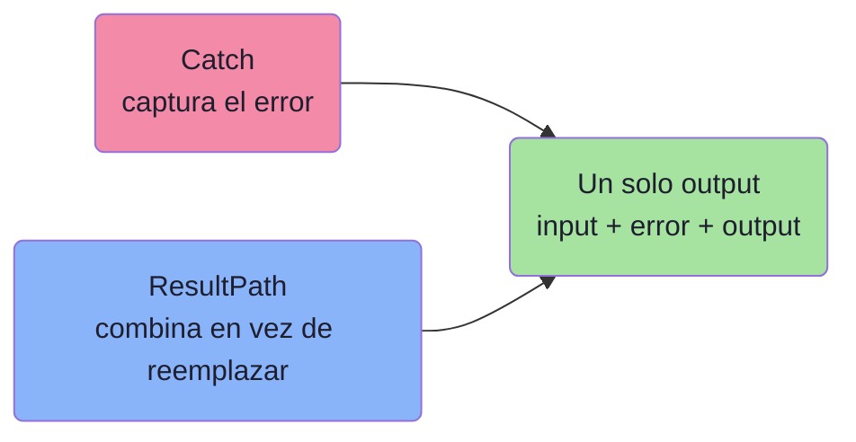
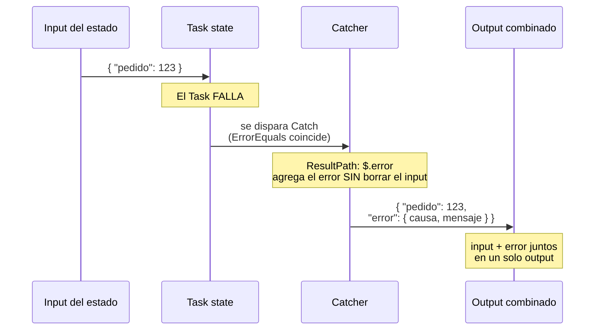
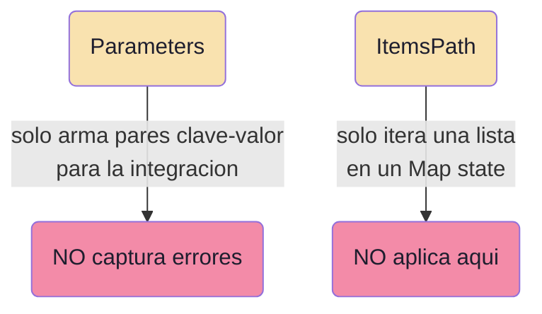

# Step Functions: capturar el error y juntar todo en un solo output

## El problema

Tienes un workflow con 4 estados. Si el proceso **falla**, quieres que el output final contenga **todo lo que pasó**:

- el **input** que entró al estado,
- el **error** que ocurrió,
- el **output** que ya se había generado.

Todo junto, en una sola estructura. ¿Qué campos de Step Functions usas?

**Respuesta: `Catch` (para capturar el error) + `ResultPath` (para combinar input + resultado en vez de sobreescribir).**

---

## Las dos piezas clave



### `Catch` — captura el error

- Válido en estados **`Task`, `Parallel` y `Map`**.
- Es un **array de "catchers"**. Cada catcher tiene:
  - `ErrorEquals`: qué tipos de error atrapa (ej. `States.ALL`).
  - `Next`: a qué estado ir cuando ocurre el error.
  - `ResultPath`: dónde colocar la info del error.
- Sin `Catch`, un error **termina el workflow completo** de inmediato.

### `ResultPath` — combina en lugar de reemplazar

- Controla **dónde** se guarda el resultado (o el error) dentro del JSON de estado.
- Si NO lo usas, el resultado **reemplaza** todo el input.
- Si lo usas (ej. `"ResultPath": "$.error"`), el resultado se **agrega** al input original bajo esa clave, **conservando el input**.

---

## Cómo fluye el estado con Catch + ResultPath



---

## Ejemplo de definición (JSON)

```json
{
  "StartAt": "ProcesarPedido",
  "States": {
    "ProcesarPedido": {
      "Type": "Task",
      "Resource": "arn:aws:lambda:...:function:procesar",
      "Catch": [
        {
          "ErrorEquals": ["States.ALL"],
          "Next": "ManejarError",
          "ResultPath": "$.error"
        }
      ],
      "ResultPath": "$.resultado",
      "Next": "Siguiente"
    },
    "ManejarError": {
      "Type": "Pass",
      "End": true
    }
  }
}
```

- `"ResultPath": "$.error"` dentro del `Catch`: agrega el error bajo la clave `error`, **manteniendo** el input original.
- `"ResultPath": "$.resultado"` en el camino de éxito: agrega el resultado bajo `resultado`, **sin borrar** el input.

### Diferencia visual de ResultPath

| Sin ResultPath | Con `ResultPath: $.resultado` |
|---|---|
| Input: `{ "pedido": 123 }` | Input: `{ "pedido": 123 }` |
| Resultado reemplaza todo | Resultado se agrega |
| Output: `{ "status": "ok" }` | Output: `{ "pedido": 123, "resultado": { "status": "ok" } }` |
| Se **pierde** el input | Se **conserva** el input |

---

## Por qué las otras opciones fallan



| Campo | Para qué sirve realmente | ¿Sirve aquí? |
|---|---|---|
| **Catch** | Capturar errores en Task/Parallel/Map | **Sí** |
| **ResultPath** | Combinar input + resultado (no reemplazar) | **Sí** |
| Parameters | Construir clave-valor (estático o del input) para la integración | No captura errores |
| ItemsPath | Iterar sobre una lista (solo en Map state) | No agrega input+output |

- **Parameters + ItemsPath** (opciones A y D en parte) falla por partida doble: ni captura el error ni corresponde al caso.
- **Parameters + ResultPath** (opción C): ResultPath sí sirve, pero **Parameters no captura el error**. Falta el `Catch`.

---

## Resumen de examen (DVA-C02)

Regla mnemotécnica:

- **Capturar un error** → `Catch`.
- **Combinar input + resultado en el output** (sin perder el input) → `ResultPath`.
- **Iterar sobre una lista** → `ItemsPath` (solo en `Map`).
- **Armar clave-valor para la integración** → `Parameters`.

Extras útiles:

- `Retry` reintenta antes de rendirse; `Catch` actúa cuando ya falló.
- `Catch` solo existe en `Task`, `Parallel` y `Map`.
- Si ves "juntar input + error + output en una sola salida" → piensa **Catch + ResultPath**.
