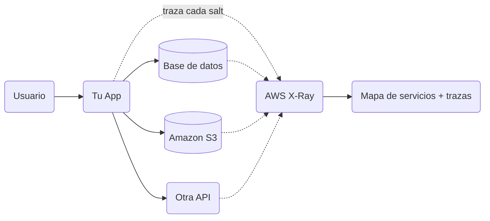
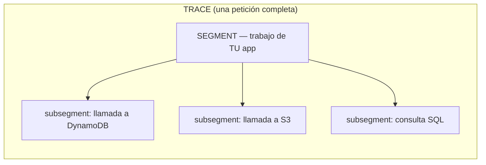
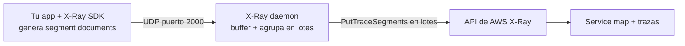
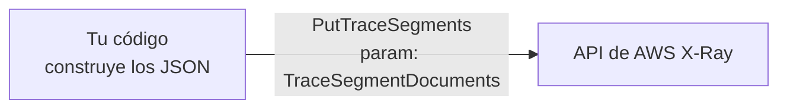
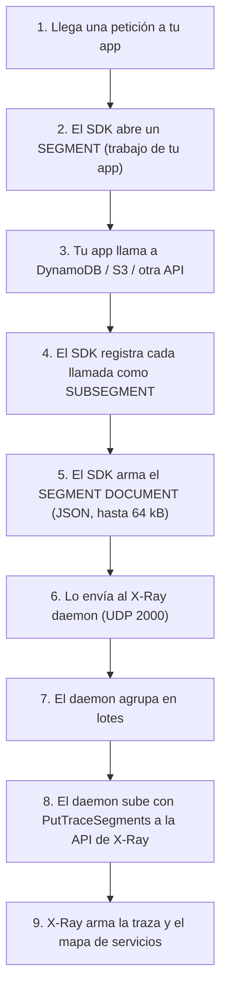
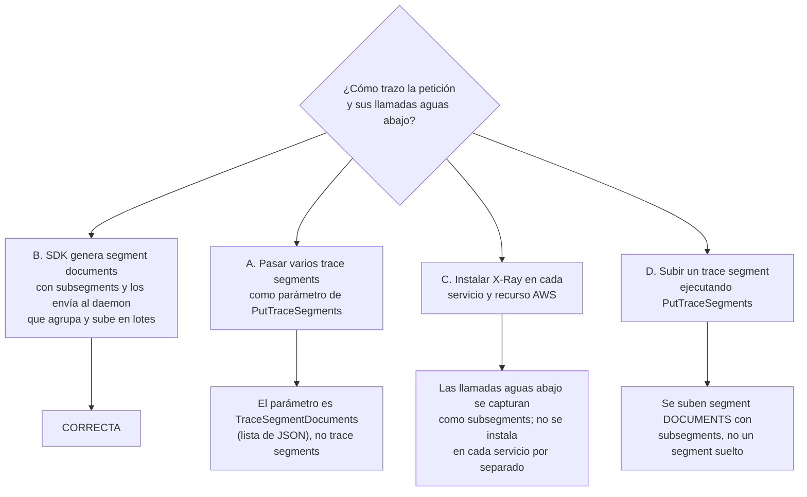

# AWS X-Ray a fondo: segments, subsegments, daemon y `PutTraceSegments`

Explicaci&oacute;n visual de la pregunta:

> **Debes trazar en X-Ray todas las peticiones de tu app, incluyendo las llamadas a recursos AWS aguas abajo. ¿Qué acción implementas?**
>
> **Respuesta correcta: B** — usar el X-Ray SDK para generar *segment documents* con *subsegments* y enviarlos al *daemon* de X-Ray, que los agrupa y sube a la API en lotes.

---

## 1. ¿Qué problema resuelve X-Ray?

Cuando una petición entra a tu aplicación, esa petición casi nunca se resuelve en un solo lugar. Tu app llama a una base de datos, a otra API, a S3, a DynamoDB... **cada salto añade latencia y puede fallar**. Sin trazado, cuando algo va lento o falla, no sabes *en qué salto* ocurrió.

**AWS X-Ray** graba lo que pasa en cada salto y lo une en un **mapa de servicios** (service map) y una **traza** (trace) por petición, para que veas el recorrido completo de punta a punta.



---

## 2. El vocabulario: trace, segment y subsegment

Estos tres términos son el corazón de la pregunta. Defínelos bien y todo lo demás encaja.

| Término | Qué es | Analogía |
|---|---|---|
| **Trace** (traza) | Todo el recorrido de **una** petición a través de todos los servicios. Agrupa varios segments. | El viaje completo de un paquete de origen a destino. |
| **Segment** | El trabajo que hace **tu propia aplicación** para servir esa petición (tu servicio). | Lo que hace **una** oficina de correos con el paquete. |
| **Subsegment** | El trabajo de las **llamadas aguas abajo**: a otra API, a un recurso AWS (DynamoDB, S3), a una consulta SQL. Va **anidado dentro** de un segment. | Cada gestión concreta dentro de esa oficina (pesar, sellar, enviar al camión). |



> **Clave de la pregunta:** para capturar las **llamadas aguas abajo** (a recursos AWS), esas llamadas se registran como **subsegments** dentro del segment de tu app. Por eso NO instalas X-Ray "en cada servicio por separado": los subsegments ya capturan esos saltos dentro de la misma traza.

---

## 3. El *segment document*: el JSON que se envía

Lo que realmente viaja a X-Ray es un **segment document**: un **JSON** que describe el trabajo de la petición.

- Es una **cadena JSON** con formato definido.
- Puede pesar **hasta 64 kB**.
- Contiene un **segment completo con sus subsegments** (o un fragmento, o un subsegment suelto enviado aparte).

```json
{
  "name": "mi-app",
  "id": "70de5b6f19ff9a0a",
  "trace_id": "1-5e1b4151-5ac6c58dc...",
  "start_time": 1727980800.0,
  "end_time": 1727980800.9,
  "subsegments": [
    {
      "name": "DynamoDB",
      "namespace": "aws",
      "start_time": 1727980800.1,
      "end_time": 1727980800.3
    },
    {
      "name": "consulta-SQL",
      "start_time": 1727980800.4,
      "end_time": 1727980800.6
    }
  ]
}
```

> **Ojo con los nombres:** la API se llama `PutTraceSegments` y su parámetro es **`TraceSegmentDocuments`** (una **lista de documentos JSON**), no "trace segments" sueltos. Este detalle es justo lo que hace que las opciones A y D sean incorrectas.

---

## 4. ¿Cómo llegan los datos a X-Ray? Dos caminos

Aquí está el núcleo de la respuesta B. Hay **dos** formas de mandar los segment documents a X-Ray:

### Camino 1 (recomendado): SDK → daemon → API en lotes

El **X-Ray SDK** instrumenta tu código y genera los segment documents. En vez de llamar a AWS directamente, se los pasa al **daemon de X-Ray**, un pequeño proceso que corre junto a tu app. El daemon **almacena en búfer** los documentos y los **sube en lotes** (batches) llamando a `PutTraceSegments` por ti.



**Por qué se prefiere:** el SDK **no** hace llamadas a AWS directamente en el hilo de tu petición; solo manda el documento al daemon (rápido, local, por UDP). El daemon agrupa muchos documentos y hace menos llamadas a la API. Menos latencia para tu app, menos llamadas a AWS.

### Camino 2 (directo): tú mismo llamas a `PutTraceSegments`

También puedes saltarte el daemon y **llamar tú mismo** a la API `PutTraceSegments`, enviando la lista `TraceSegmentDocuments`. Es válido, pero cargas con las llamadas a AWS en tu propio código.



> **Dato de examen:** el daemon existe precisamente **para agrupar** los documentos y **evitar que el SDK llame a AWS directamente**. Ambos caminos terminan en la misma API `PutTraceSegments`.

---

## 5. El flujo completo, de principio a fin



---

## 6. Por qué B es correcta y las demás no



| Opción | Veredicto | Razón |
|---|---|---|
| **B** | ✅ Correcta | El SDK genera *segment documents* con *subsegments* (que capturan las llamadas aguas abajo) y los manda al *daemon*, que agrupa y sube en lotes a la API. Es el patrón recomendado. |
| **A** | ❌ | El parámetro de `PutTraceSegments` es **`TraceSegmentDocuments`** (lista de documentos JSON), no "trace segments" sueltos. Nombre incorrecto del concepto. |
| **C** | ❌ | No trazas la app y cada servicio por separado esperando un único resultado. Las llamadas aguas abajo se capturan como **subsegments** dentro de la traza de tu app. |
| **D** | ❌ | Lo que se sube son **segment documents con subsegments**, no un "trace segment" suelto. Confunde el objeto que viaja. |

---

## 7. Resumen en una frase

> Instrumentas con el **X-Ray SDK**, que produce **segment documents** (JSON de hasta 64 kB) donde tu app es el **segment** y cada llamada aguas abajo es un **subsegment**; esos documentos van al **daemon**, que los **agrupa y sube en lotes** con `PutTraceSegments`. La alternativa directa es llamar tú a `PutTraceSegments` con la lista `TraceSegmentDocuments`.

**Enlaces oficiales:**

- Enviar datos a X-Ray (SDK y daemon): https://docs.aws.amazon.com/xray/latest/devguide/xray-api-sendingdata.html
- Segment documents (estructura JSON, 64 kB, subsegments): https://docs.aws.amazon.com/xray/latest/devguide/xray-api-segmentdocuments.html
- API `PutTraceSegments`: https://docs.aws.amazon.com/xray/latest/api/API_PutTraceSegments.html
